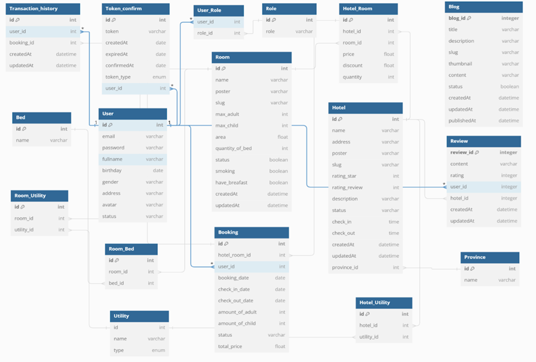
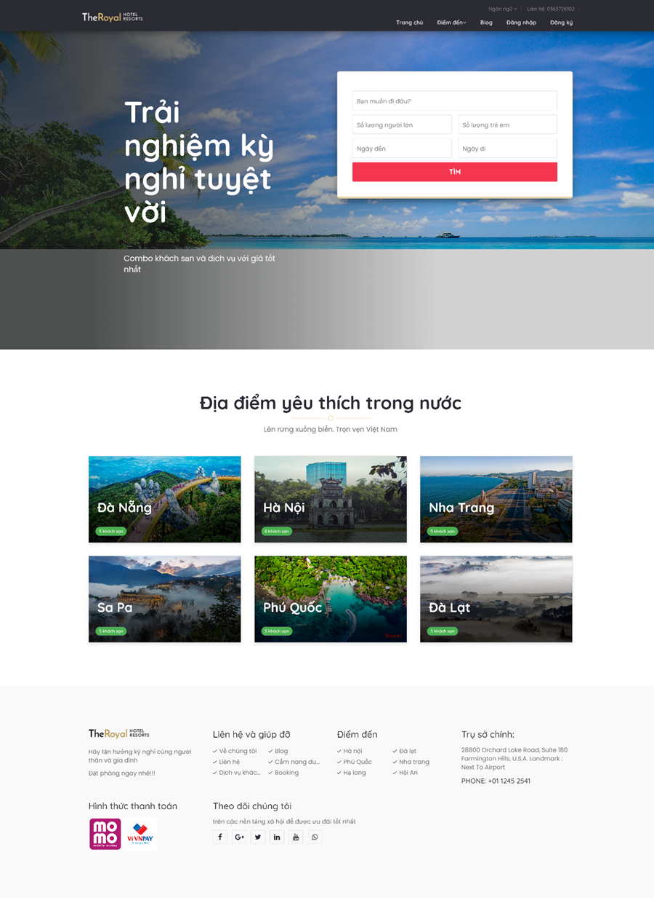
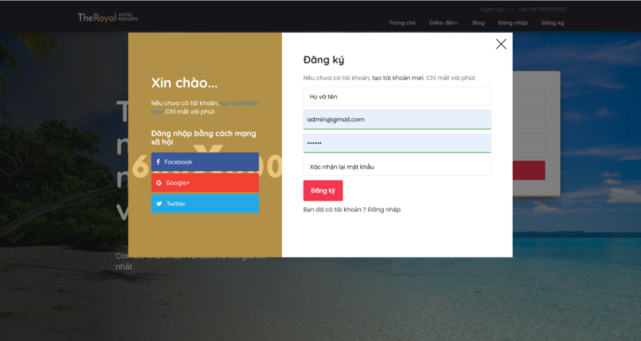
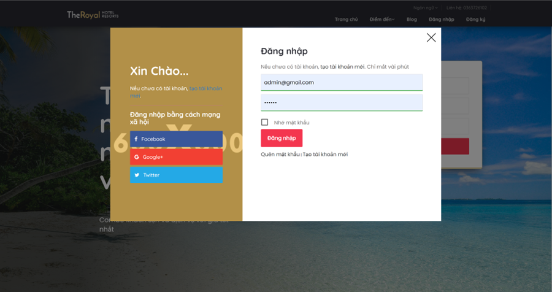
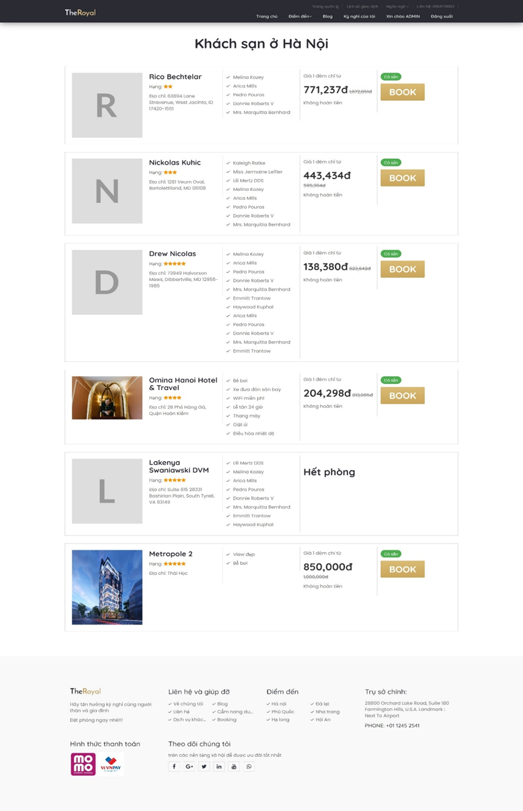
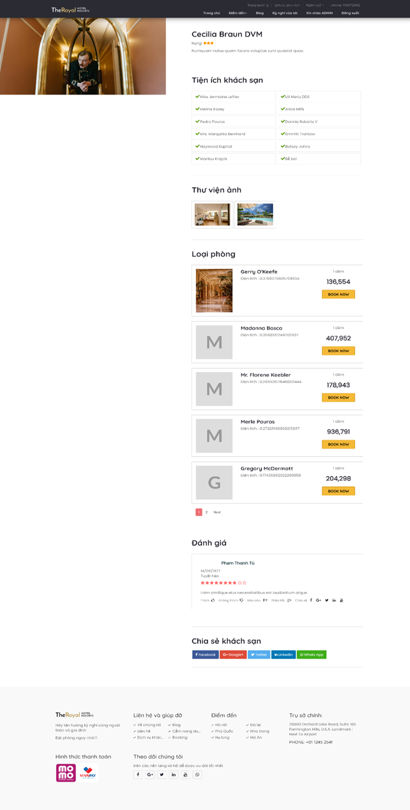
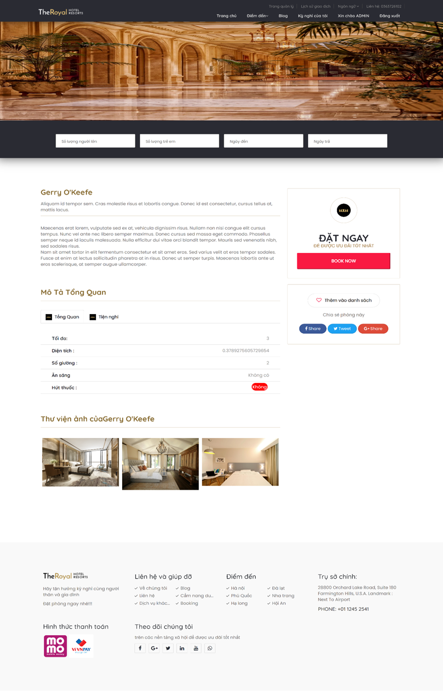
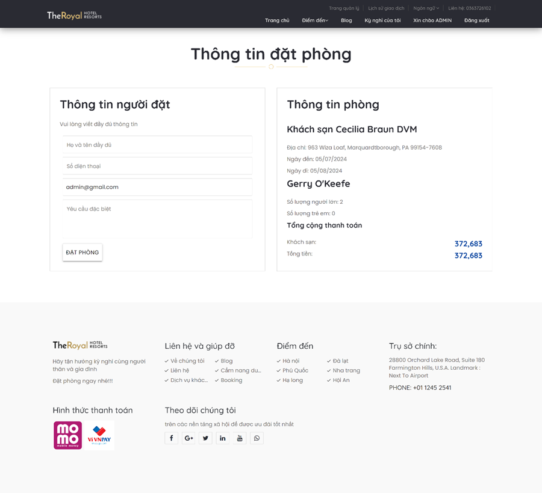
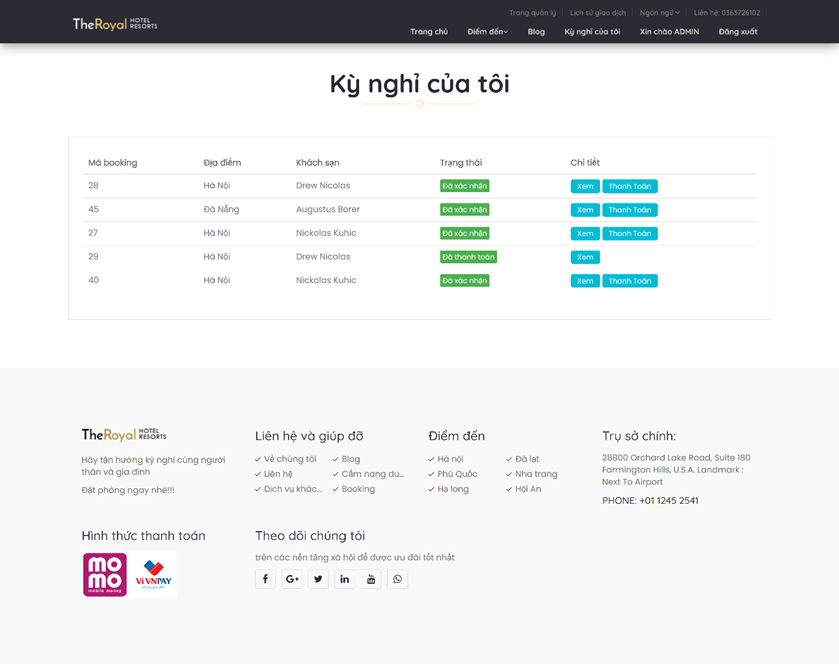

# Booking Hotel Application

## Giới thiệu
`Booking-hotel` là một hệ thống đặt phòng khách sạn, chịu trách nhiệm xử lý các yêu cầu từ phía người dùng và hiển thị dữ liệu liên quan đến khách sạn, phòng, đặt chỗ, blog, thanh toán và tài khoản người dùng.

## Các chức năng chính

### 1. Trang chủ
- **Endpoint:** `/`
- **Mô tả:** Hiển thị danh sách các tỉnh có nhiều khách sạn nhất và danh sách tất cả các tỉnh.

### 2. Chi tiết phòng khách sạn
- **Endpoint:** `/hotel/{hotelId}/room/{roomId}/{slug}`
- **Mô tả:** Hiển thị thông tin chi tiết về phòng khách sạn dựa trên ID khách sạn và phòng.

### 3. Chi tiết khách sạn
- **Endpoint:** `/hotel/{id}/{slug}`
- **Mô tả:** Hiển thị thông tin chi tiết về một khách sạn, bao gồm đánh giá và danh sách phòng.

### 4. Danh sách blog
- **Endpoint:** `/blogs`
- **Mô tả:** Hiển thị danh sách bài viết trên blog.

### 5. Chi tiết bài viết blog
- **Endpoint:** `/blog/{id}/{slug}`
- **Mô tả:** Hiển thị nội dung của một bài viết blog.

### 6. Tìm kiếm khách sạn theo tỉnh
- **Endpoint:** `/hotels`
- **Mô tả:** Tìm kiếm danh sách khách sạn dựa trên địa điểm và số lượng khách.

### 7. Trang đặt phòng
- **Endpoint:** `/booking/{hotelId}/{roomId}`
- **Mô tả:** Hiển thị trang đặt phòng dựa trên khách sạn và phòng được chọn.

### 8. Xác thực tài khoản
- **Endpoint:** `/xac-thuc-tai-khoan`
- **Mô tả:** Xác thực tài khoản người dùng thông qua token.

### 9. Đặt lại mật khẩu
- **Endpoint:** `/resetPassword`
- **Mô tả:** Cho phép người dùng đặt lại mật khẩu bằng token xác thực.

### 10. Danh sách đặt phòng của tôi
- **Endpoint:** `/my-booking`
- **Mô tả:** Hiển thị danh sách các đơn đặt phòng của người dùng hiện tại.

### 11. Lịch sử thanh toán của tôi
- **Endpoint:** `/my-payment`
- **Mô tả:** Hiển thị danh sách các giao dịch thanh toán của người dùng hiện tại.
## Diagram

## Màn hình
### Trang chủ

### Đăng ký

### Đăng nhập

### Danh sách khách sạn

### Chi tiết khách sạn

### Chi tiết phòng 

### Đặt phòng

### Kỳ nghỉ của tôi

## Cách chạy dự án

### Yêu cầu hệ thống
- Java 11+
- Maven
- Spring Boot

### Cài đặt
1. Clone repository:
   ```sh
   git clone <https://github.com/PhamThanhTu612002/Java21/tree/master/SpringBoot/Spring_Boot/booking-hotel>
   ```
2. Chạy ứng dụng:
   ```sh
   mvn spring-boot:run
   ```

## Đóng góp
Nếu bạn muốn đóng góp vào dự án, vui lòng tạo một Pull Request hoặc mở một Issue để thảo luận.

## Tác giả
Dự án được phát triển bởi **Phạm Thanh Tú**.

## Giấy phép
Dự án này tuân theo giấy phép MIT License.
